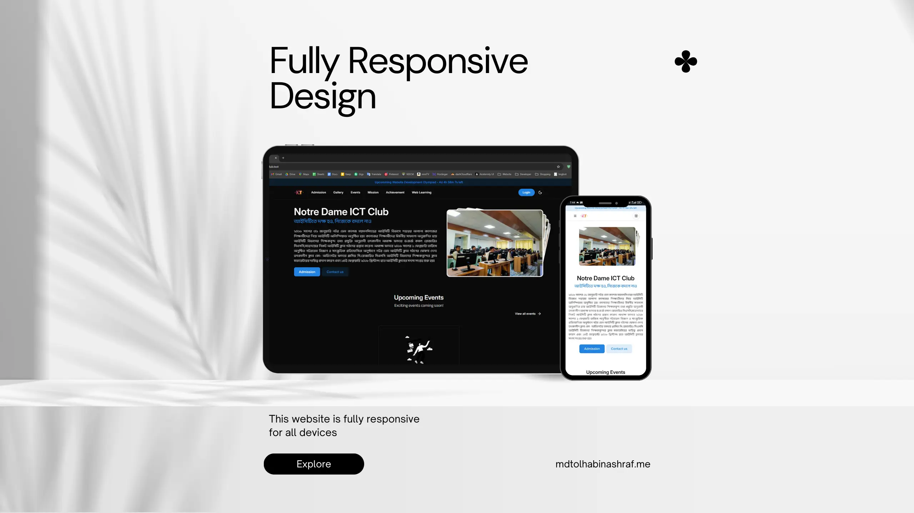

# Notre Dame ICT Club

This is a **responsive website** for the ICT Club of Notre Dame College Mymensingh, built with a **PHP Laravel** backend and a **React** frontend. The project is production-ready and features a modern admin panel.

## Key Features

- **Theme Management:** Easily switch between dark and light modes with a default theme management system.
- **Fully Responsive Design:** Optimized for phones, tablets, laptops, and desktops.
- **Comprehensive Club Information:** Learn about the club’s history, admission rules and fees, events, mission, and achievements.
- **Contact Form:** Communicate directly with ICT Club moderators and administrators.
- **Web Learning Page:** Introductory resources on web development for beginners.

---

## Technologies Used

- **Backend:** PHP Laravel
- **Frontend:** React
- **Styling:** Responsive CSS frameworks

---

## Get Involved

For more information or to contribute, please contact the ICT Club moderators or administrators via the website’s contact form.
